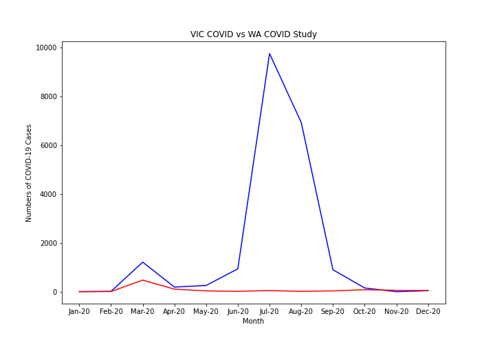
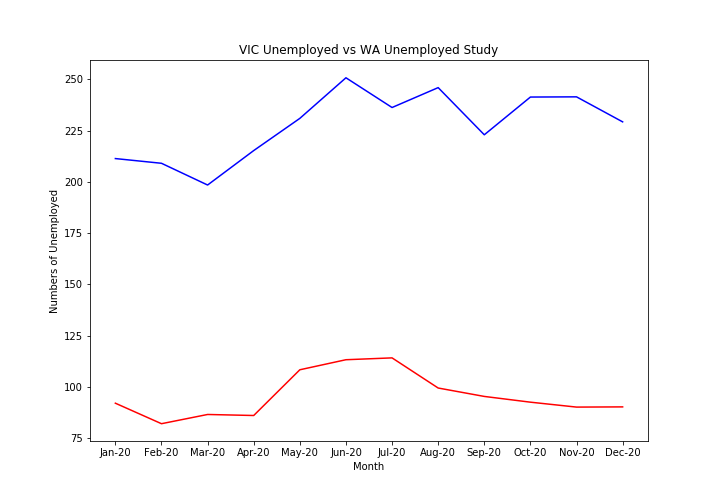
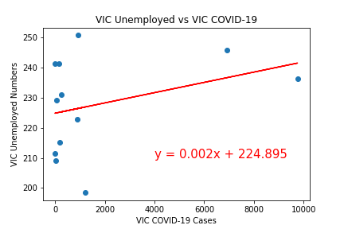
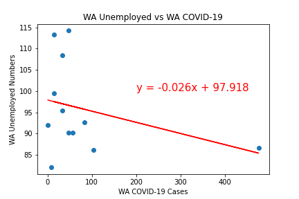
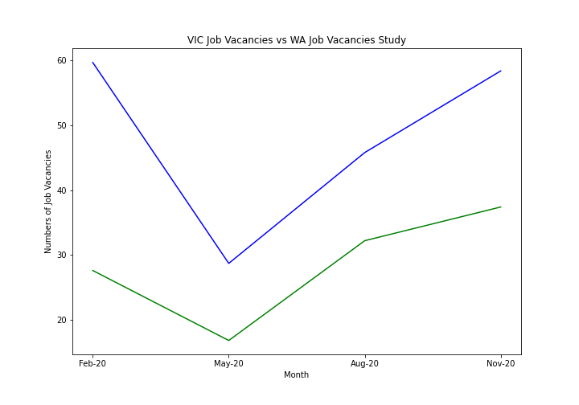
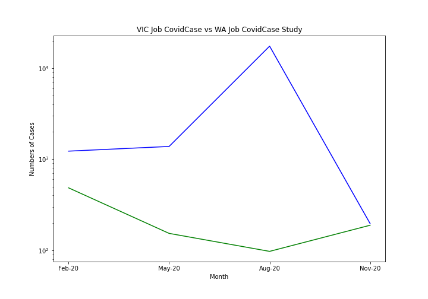
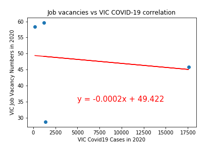
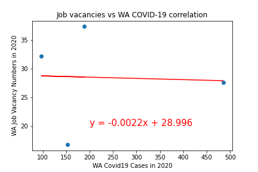

# Project 1 - Unemployment in Australia 2020 

An analysis of the unemployment rates in Australia in 2020. Our hypothesis is that the COVID-19 pandemic will have impacted the unemployement rates in Australia. We were interested to see what effects that COVID had, and how it may have impacted different states.


# Project Structure 

```
Project_1 
|
__P1_final.ipynb      # Jupyter Notebook of Code 
|
__Proposal/
         |_           # txt of our initial proposal 
|
__Outputs/

         |_           #png files of graphs 
|__Source/
         |_           #csv files of datasets 

```


# Usage 

Not sure what we put here 

# Questions 

Questions we had before we began our analysis:
1. Was there an increase or decrease in unemployment? 
2. How was unemployment impacted between WA amd VIC?
3. Was there a correlation between infection rates and unemployment in 2020? 


# Datasets 


- [Australian Bureua of Statistics - Unemployment](https://www.abs.gov.au/statistics/labour/employment-and-unemployment/labour-force-australia-detailed/feb-2021#unemployment)
- [Australian Bureua of Statistics - Job Vacancies](https://www.abs.gov.au/statistics/labour/employment-and-unemployment/job-vacancies-australia/feb-2021)
- [National Notifiable Diseases Surveillance Scheme(NNDSS)](http://www9.health.gov.au/cda/source/cda-index.cfm)


# Analysis 

1. Was there an increase or decrease in unemployment?
\n
We can see that there was an increase in unemployment in 2020


2. How was unemployment impacted between WA amd VIC?

We can see that VIC had the largest % of COVID cases in Australia 


We can see the impacts of COVID-19 and Unemployment in Victoria and WA 























# Contributers 

Helen Amin 
Heriawan Muhamad 
Samantha Van Wyngaarden 
Stephanie Salvona 


