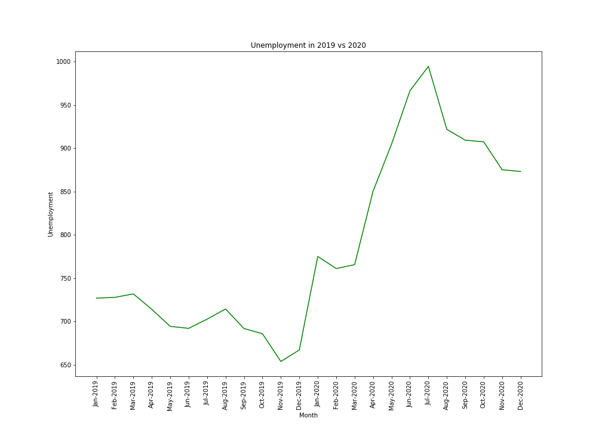
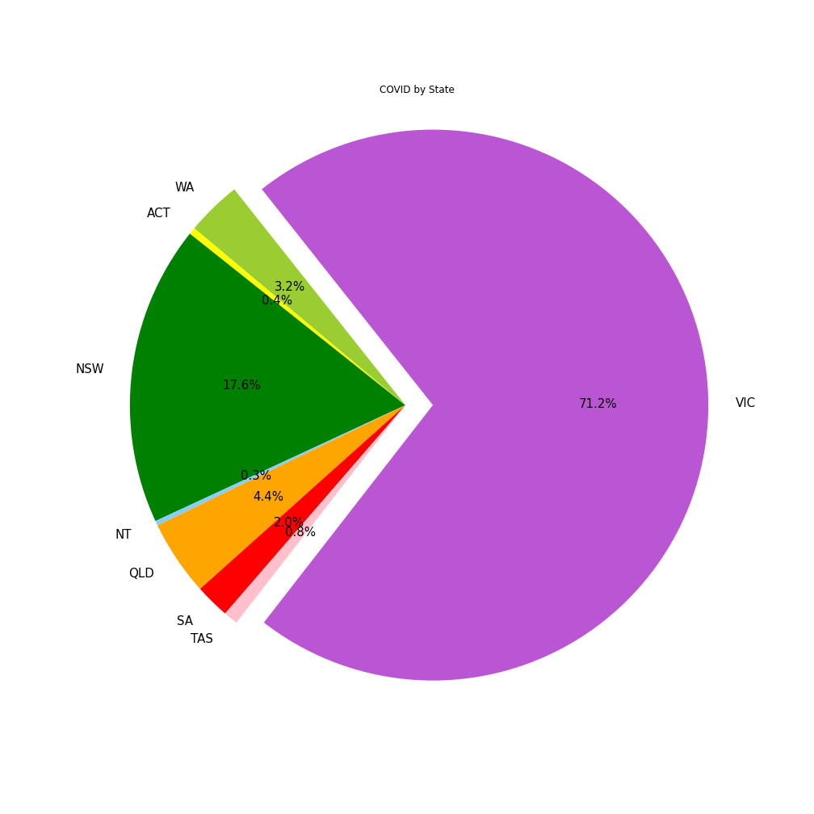
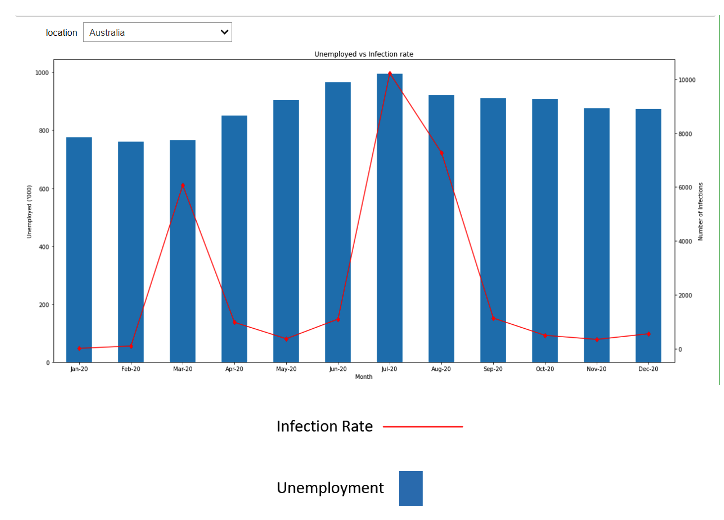
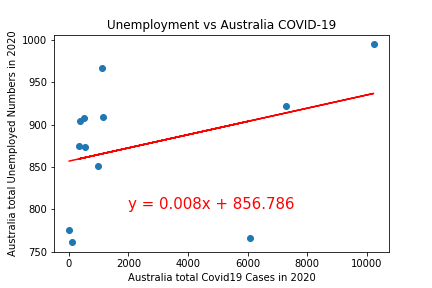
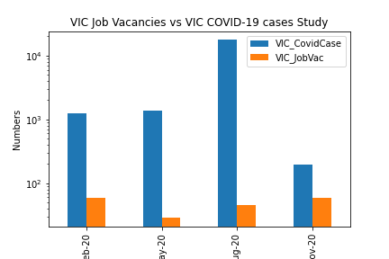
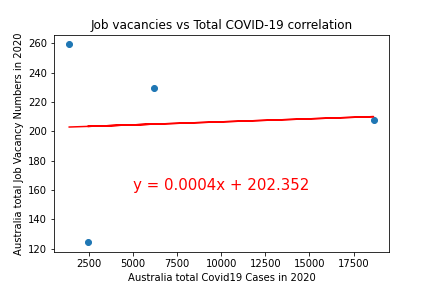

# Project 1 - Unemployment in Australia 2020 


An analysis of the unemployment rates in Australia in 2020. Our hypothesis is that the COVID-19 pandemic will have impacted the unemployement rates in Australia. We were interested to see what effects COVID had, and how it may have impacted different states.


# Project Structure 

```
Project_1 
|
__P1_final.ipynb      # Jupyter Notebook of Code 
|
__Project1.pptx       # PowerPoint Presentation
|
__Proposal/
            |_        # txt of our initial proposal 
|
__Outputs/
            |_        # png files of graphs 
|
__Source/
            |_        # csv files of datasets 
|
__Project_Image/
            |_        # Images for readme 
```

# Created with 

This project was created using: 
- Excel
- Jupyter Notebook 
- PowerPoint 

The data sources and notebook code can be found the in the repository folders.


# Questions 

Questions we had before we began our analysis:
1. Was there an increase or decrease in unemployment? 
2. How was unemployment impacted between WA amd VIC?
3. Was there a correlation between infection rates and unemployment in 2020? 


# Datasets 


- [Australian Bureua of Statistics - Unemployment](https://www.abs.gov.au/statistics/labour/employment-and-unemployment/labour-force-australia-detailed/feb-2021#unemployment)
- [Australian Bureua of Statistics - Job Vacancies](https://www.abs.gov.au/statistics/labour/employment-and-unemployment/job-vacancies-australia/feb-2021)
- [National Notifiable Diseases Surveillance Scheme(NNDSS)](http://www9.health.gov.au/cda/source/cda-index.cfm)


# Analysis 

1. Was there an increase or decrease in unemployment?

We can see that there was an increase in unemployment in 2020 when compared with 2019. Interestingly there is an increase in unemployment between January and March before COVID really started to impact to Australia. The increase in unemployment continues after March, which could be related to COVID-19



2. How was unemployment impacted between WA amd VIC?

This graph shows that Victoria had the largest % of COVID cases in Australia. We should consider that Victoria does have a much higher population when compared to states like ACT. However, the infection numbers are much higher than similar states like NSW, so we can conclude they had the largest infection rate. This prompted us to look into the inpacts on COVID and unemployment in VIC and WA in particular. 


This graph shows the infection rate in Australia vs Unemployment for Australia. The COVID infection peak in July/August was likely caused by the outbreak in Victoria. 



We can see the comparison of COVID-19 vs Unemployment in Victoria and WA. The change in unemployment is not as significant as we expected it to be. Reasons could be that Job Keepers was available to impacted businesses, people working from home, or that the media exaggerated the impacts. We used a logarithmic scale on this graph to compress the scale and make the data easier to comprehend.       


The below graph shows the correlation between unemployment numbers in Australia vs the COVID-19 infection. As we can see there is a correlation, however it is only 0.35, so there may have been other factors which inpacted unemployment in Austrlia in 2020. 



We wanted to look into job vacancies vs COVID-19 infection numbers to see if there was a correlation. The bar chart shows that there was a decrease in the number of job vacancies in May 2020. This is likely because most of Austrlia was in a lockdown period and businesses were adjusting to how they would operate under COVID restrictions. As states come out of lcokdown, there is an increase in job vacancies across the Country. 



The correlation between job vacancies in Australia and COVID-19 is 0.06. This suggests that there is no correlation between job vacancies and the pandemic.         


# Conclusions and Further Study 

1. There is a correlation between unemployment and COVID infection rates, however it is 0.35 and is not as strong as we expected when we began our analysis. 
2. There was limited COVID-19 raw data available for us to analyse. As more information becomes available, there could be more datasets available for furhter study. We would like to continue our research into how different industries were impacted by the pandemic. 

# Contributers 

- [Helen Amin](https://github.com/helenamin)
- [Heriawan Muhamad](https://github.com/xsbaggages)
- [Samantha Van Wyngaarden](https://github.com/SamanthaVanWyngaarden)
- [Stephanie Salvona](https://github.com/sSalvs)


